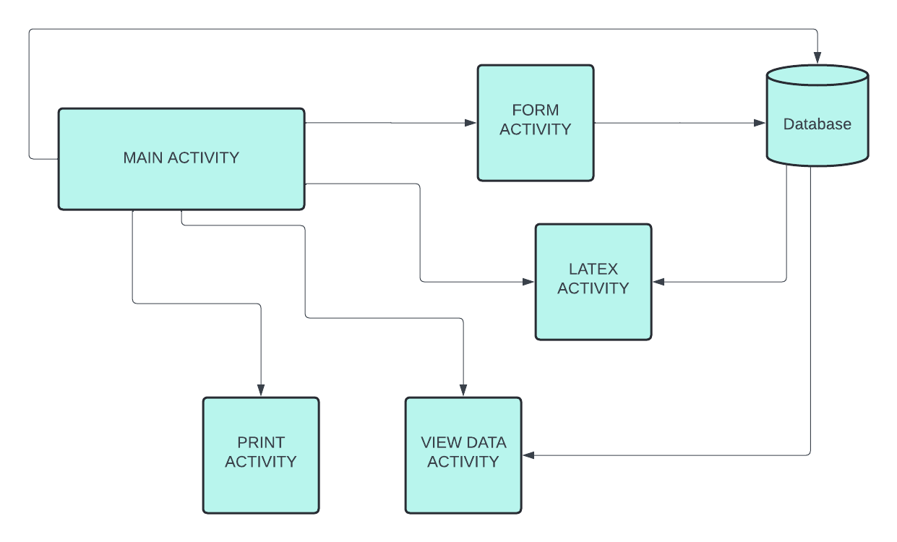
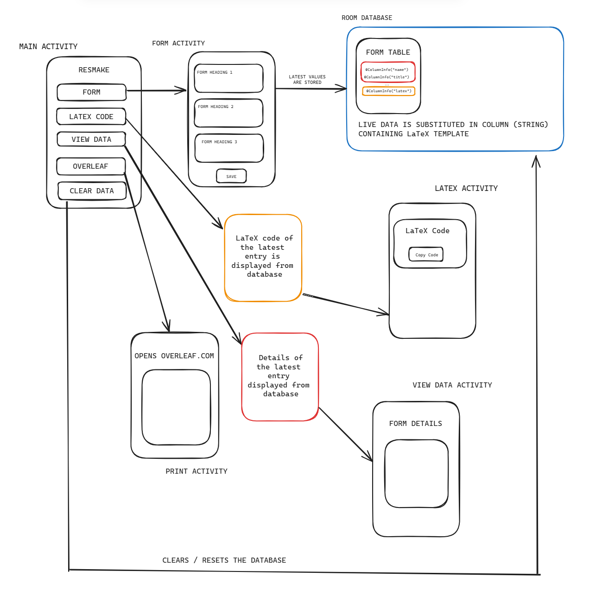

### ResMake

**ResMake** is a mobile application that generates a professional resume using a predefined LaTeX template.

-  Allows users to input personal, educational, and professional details through a structured form-based UI
-  Maps user input to LaTeX code using Room database for persistent storage
-  Streamlines resume creation for users with no LaTeX experience 
-  Offers seamless export to Overleaf for final formatting

### Workflow  

### App Navigation  

### Stack

- **Frontend**: XML
- **Frontend**: Kotlin
- **Database**: Room ORM Library

### Acknowledgements

Special thanks to [**Cyril Noah**](https://github.com/cyrilnoah1) for their helpful contributions to **ResMake**.

